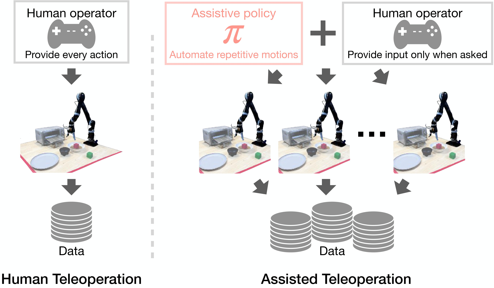
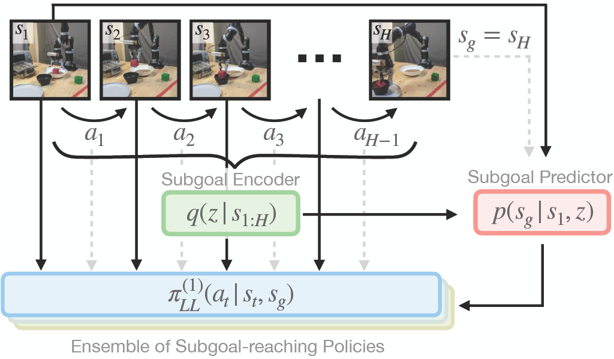
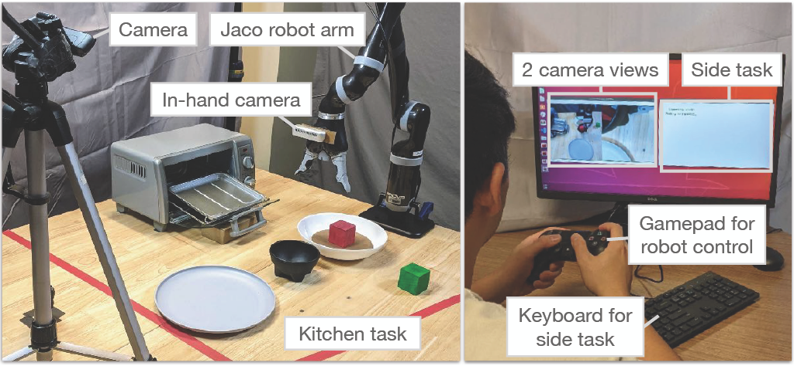
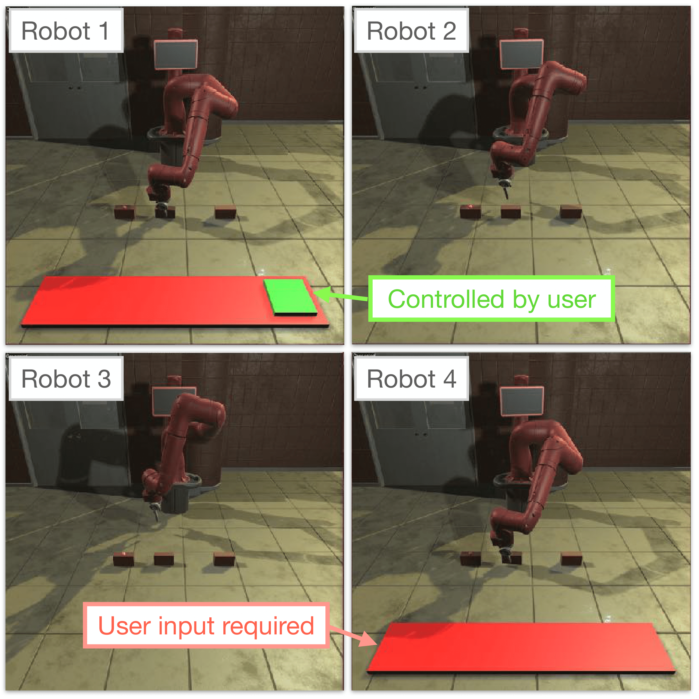
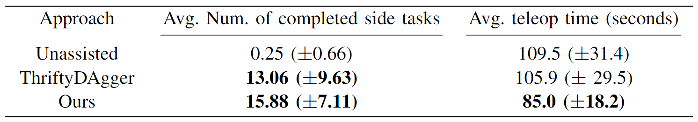
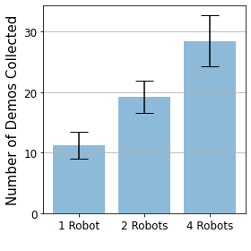
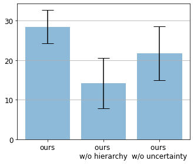

----

## Motivation
Recently, many works have shown impressive robot learning results from diverse, human-collected demonstration datasets. They underline the importance of scalable robot data collection. Yet, the current standard approach for demonstration collection, human teleoperation, is tedious and costly: tasks need to be demonstrated repeatedly and each operator can control only a single robot at a time. We take inspiration from other fields of machine learning, such as semantic segmentation, where costly labeling processes have been substantially accelerated by providing human annotators with learned assistance systems, e.g., in the form of rough segmentation estimates, that drastically reduce the labeling burden. Similarly, we propose using a learned policy to automate control of repeatedly demonstrated behaviors and ask for user input only when facing a novel situation or when unsure which behavior to execute.



----


## Policy Assisted Teleoperation (PATO)

To model long-horizon, multi-task data, we propose using a hierarchical policy with a subgoal predicted and a low-level subgoal reaching policy.
* <b> Subgoal predictor</b>: We train the subgoal predictor as a conditional variational auto-encoder over subgoals. Given a prior dataset of trajectories, we sample a state <b>s<sub>t</sub></b> and predict the subgoal <b>s<sub>t+H</sub></b> H steps in the future.
* <b> Low-level subgoal reaching policy</b>: Subgoal reaching policy is an ensemble of goal conditioned action-sequence predictor, modelled using LSTM. The policy is trained using behavior cloning loss to predict the sequence of actions <b>a<sub>t</sub>, a<sub>t+1</sub> ... a<sub>t+H-1</sub></b> conditioned on the current state <b>s<sub>t</sub></b> and the subgoal <b>s<sub>t+H</sub></b>.



----


## Deciding When to Request User Input

A policy should request help when it is uncertain about what action to take next. This can occur when (1) the policy faces a novel situation that is not present in the training data - <b>policy uncertainty</b> (2) the policy faces a seen situation, but the there are multiple possible continuations and the policy is not sure which one to pick - <b>task uncertainty</b>.
![Visualization of our assistive teleoperation policy on a task from the real-robot user study: "place red block in bowl; place bowl on plate; put green block in oven". The policy autonomously executes familiar behaviors, but asks for user input in frames (2) and (4) to determine where to place bowl and green block (white vs. yellow arrow). In these cases, the task uncertainty surpasses the threshold ω since the subgoal predictor produces subgoals for both possible targets. Further, the policy asks for user input in frame (3) since the required transition between placing the bowl and picking up the green block was not part of its training data. Thus, the policy uncertainty estimate surpasses its threshold γ.](./img/quali_figure.png)

* <b>Modelling Policy Uncertainty</b>: We model the policy uncertainty by an ensemble of low level policies. By measuring the variation in the outputs of the ensemble we can estimate the uncertainty of the policy.
* <b>Modelling Task Uncertainty</b>: We use our hierarchical subgoal predictor to estimate the task uncertainty. We sample multiple goals from the subgoal predictor and measure their variance. The variance is high near uncertain states since the stochastically sampled goals spread out more as seen in the animation below.
<table style="width:100%; margin: auto; max-width: 1200px; table-layout: fixed;">
<tbody>
  <tr style="border-bottom: none;">
    <td style="text-align: center">
      <video height="auto" width="95%" controls autoplay loop muted>
      <source src="video/task_uncertainty.mp4" type="video/mp4">
      </video>
    </td>
  </tr>
  <tr style="border-bottom: none;">
    <td style="text-align: center">
      <figcaption>Visualizing Sampled Subgoals</figcaption>
    </td>
  </tr>
</tbody>
</table>
----


## Experiments

An assistive policy for large scale data collection must work autonomously and ask for help only when uncertain, thus allowing the teleoperator to multi-task (e.g., control other robots). We measure how effectively our method can allow users to multi-task in a user study. We then demonstrate how robot data collection can be scaled in a multi-robot data collection study. 
<table style="width:100%; margin: auto; max-width: 1200px; table-layout: fixed;">
<tbody>
  <tr style="border-bottom: none;">
    <td style="text-align: center; width:64.5%;">
       <figcaption>User Study Setup</figcaption>
    </td>
    <td style="text-align: center; width:30%"> 
        <figcaption>Multi-Robot Setup</figcaption>
    </td>
  </tr>
  <tr style="border-bottom: none;">
    <td style="text-align: center; width:64.5%;">
        
    </td>
    <td style="text-align: center; width:30%"> 
        
    </td>   
  </tr>
</tbody>
<table>
----


## User Study

The participants are required to complete the given robot tasks while also solving as many side tasks as possible to measure their ability to multitask while collecting data. The participants control the robot with PATO (ours), ThriftyDAgger (baseline) and no-assistance.
<table style="width:100%; margin: auto; max-width: 1200px; table-layout: fixed;"><tbody><tr style="border-bottom: none;"><td style="text-align: center"><video height="auto" width="95%" controls autoplay loop muted>
        <source src="video/user_study_demo.mp4" type="video/mp4">
      </video>
    </td>
  </tr>
</tbody>
<table>

Quantitative results show that participants are able to complete more side tasks with assisted methods. Since unassisted teleoperation requires the user's full attention, they are unable to solve any side task during teleoperation. 
<br>



Further, subjective measures indicate that participants <b>trusted the robot</b> significantly more to perform the correct action at the correct time, the robot to be significantly <b>more intelligent</b> and the participants were significantly <b>more satisfied</b> while teleoperating with PATO as compared to the baselines. Using NASA TLX survey we also showed a <b>lower mental workload</b> while using the proposed approach compared to the baselines.

----


## Multi-Robot Data Collection
We demonstrate scaling the data collection process using multiple robots in the <a href="https://clvrai.github.io/furniture/">IKEA furniture assembly</a> environment.
<table style="width:100%; margin: auto; max-width: 1200px; table-layout: fixed;"><tbody><tr style="border-bottom: none;"><td style="text-align: center"><video height="auto" width="75%" controls autoplay loop muted>
        <source src="video/multi_robot_demo.mp4" type="video/mp4">
      </video>
    </td>
  </tr>
</tbody>
<table>

The figure below demonstrates average number of demonstrations collected in 4 minutes using multiple robots in simulation by 11 users. <b>(a)</b> With our assisted teleoperation, users can manage multiple robots simultaneously and collect more demonstrations with four robots. <b>(b)</b> Removing the hierarchical policy architecture or uncertainty-based user input requests leads to inferior demonstration collection throughput.
<br>
<table style="width:90%; margin: auto; max-width: 1200px; table-layout: fixed;">
<tbody>
  <tr style="border-bottom: none; background-color:white">
    <td style="text-align: center" width="46%">
      
    </td>
    <td style="text-align: center" width="54%">
      
    </td>
  <tr style="border-bottom: none;">
    <td style="text-align: center">
      <figcaption>(a) Simultaneous data collection with multiple robots</figcaption>
    </td>
    <td style="text-align: center">
      <figcaption>(b) Ablation study</figcaption>
    </td>
  </tr>
</tbody>
</table>

----

<!-- ## Citation -->
<!-- ```
@inproceedings{shi2022skimo,
  title={Skill-based Model-based Reinforcement Learning},
  author={Lucy Xiaoyang Shi and Joseph J. Lim and Youngwoon Lee},
  booktitle={Conference on Robot Learning},
  year={2022}
}
``` -->
<br>
